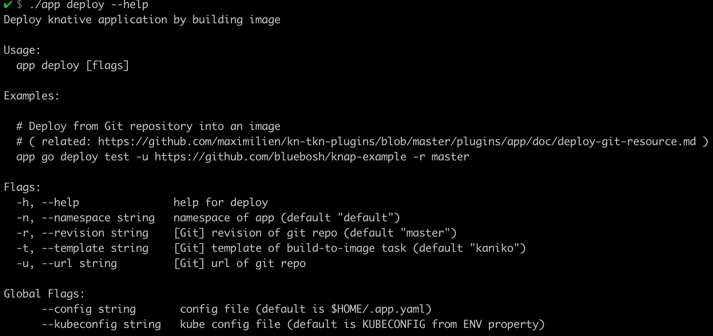
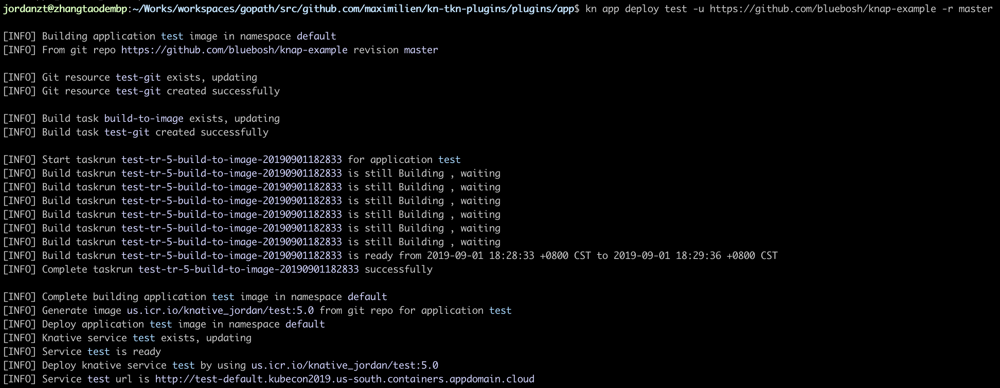

# Kn app deploy plugin

## Build image
```
  # Build from Git repository into an image
  app build test -u https://github.com/bluebosh/knap-example -r master
```

## Deploy knative application by building image
```
  # Deploy knative application by building image
  app deploy test -u https://github.com/bluebosh/knap-example -r master
```

## Plugin parameter


## Build and deploy from git repo

